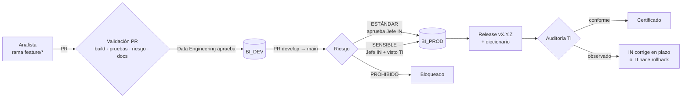

# DataOps del ambiente analítico de BI

Demo del modelo **Database DevOps** para Inteligencia de Negocios: los pases de DEV a PROD los hace un
pipeline, sin intervención operativa de TI. TI **gobierna**: define las reglas, da su visto en cambios
sensibles, audita después de cada despliegue y es el único que puede ejecutar un rollback.

> Todos los datos del repositorio son **ficticios**.



## Qué hace cada pieza

| Pieza | Dónde | Qué hace |
|---|---|---|
| SQL Project | `database/BI_Analitico` | Estado esperado de la base. El build produce el **DACPAC**, único artefacto que se promueve. |
| Validación PR | `.github/workflows/ci-validacion-pr.yml` | Compila, prueba en una base **efímera con datos**, calcula el plan contra el destino real, clasifica el riesgo y **documenta el cambio** en el PR. |
| Gate de aprobaciones | `gate-aprobaciones.yml` | Exige las aprobaciones según destino y riesgo (roles configurables). |
| Despliegue | `cd-despliegue.yml` | `develop → BI_DEV`, `main → BI_PROD`. Foto previa, recálculo de riesgo, deploy, validación post-deploy, release y auditoría. |
| Auditoría TI | `auditoria.yml` | Dictamen de TI por etiquetas, plazos (SLA) y habilitación de rollback. |
| Rollback | `rollback.yml` | Solo TI. Vuelve a una versión aprobada usando el mismo pipeline. |
| Control de drift | `drift.yml` | Cada noche detecta cambios manuales hechos fuera del pipeline. |
| Reglas de riesgo | `deployment/reglas_riesgo.yml` | Qué es ESTÁNDAR, SENSIBLE o PROHIBIDO. Dueño: TI. |
| Perfil de despliegue | `deployment/publicacion.publish.xml` | Nunca toca seguridad; bloquea la pérdida de datos salvo autorización de TI. |
| Pruebas de datos | `tests/datos/*.sql` | Cada consulta devuelve filas = falla. Incluye pruebas de **indicadores de negocio**. |
| Documentación automática | `scripts/ci/documentar.py` | Reporte HTML de cada cambio y **diccionario de datos** publicado en GitHub Pages. |

## Documentación

1. [Proceso y roles](docs/01_PROCESO_Y_ROLES.md): flujos DEV→DEV y DEV→PROD, matriz de roles, plazos.
2. [Convenciones](docs/02_CONVENCIONES.md): ramas, commits, PR, objetos SQL, versionado.
3. [Instalación de la demo](docs/03_INSTALACION.md): SQL Server, ngrok, secretos, protección de ramas.
4. [Guion de la demo](docs/04_GUION_DEMO.md): paso a paso para presentarla.
5. [Paso a Gitea](docs/05_MIGRACION_GITEA.md): qué cambia al implementarlo en Gitea.

## Estructura

```
database/BI_Analitico/      SQL Project (src: fuente simulada · tab: tablones · rpt: vistas · ctl: control)
deployment/                 reglas de riesgo y perfil de SqlPackage (gobierno de TI)
scripts/ci/                 utilitarios del pipeline (riesgo, documentación, pruebas, versión)
tests/datos/                pruebas de calidad de datos e indicadores
setup/                      scripts de instalación de la demo (bases, login, datos ficticios, job)
.github/                    workflows, plantillas de PR e issues, CODEOWNERS, etiquetas
docs/                       documentación del proceso
```
